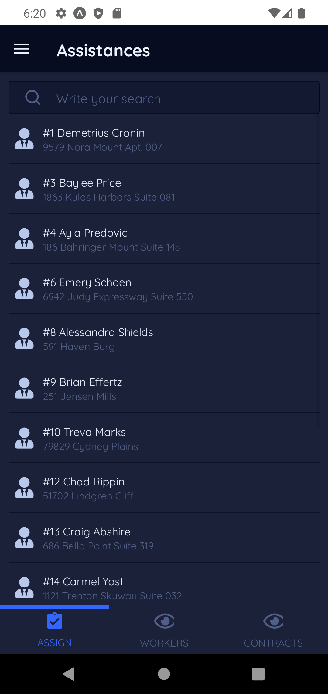

# Contracts App

### Application developed for a construction company, whose main function is to manage everything related.

### It was also developed an api to which it is connected to obtain all the data within the application.

### This application allows the management of the data handled within the company, related to workers, contracts, assignments of workers to contracts and contracts to workers, payroll payments and payments received for projects, invoice management, attendance management.

### Main panel which shows a summary of the main data such as:

- Earnings
- Money Earned
- Money Paid
- Hours Worked
- Hours Paid
- Contracts Signed
- Registered Workers

## Development technologies

- React Native Front
- Laravel Lumen Backend

## Main functions

### **All the management functions have their main methods of Add, Delete, Update and Display.**

- Worker
- Projects
- Costing
- Expenses
- Invoices
- Profit
- Customer
- Assignments of Contracts to workers
- Assignment of workers to contracts
- Display of paid invoices

## Screenshots

| - | - |
|---|---|
|  |  |
|  | |
|||
|||
|||
|||

## **Note: It is not possible to upload the system code to a public repository due to internal company policies.**
